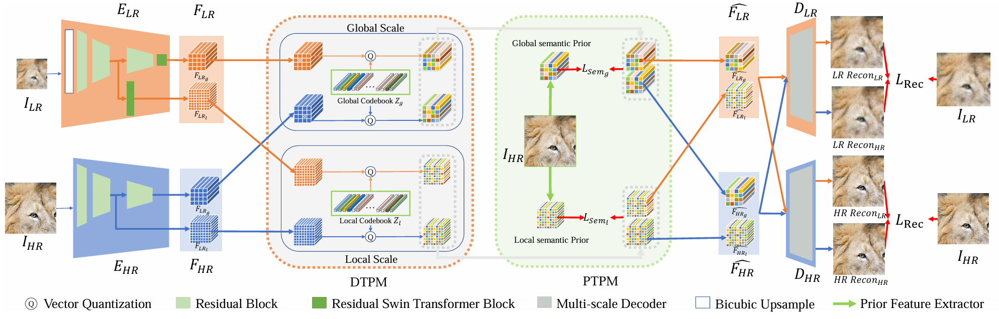

# Blind Image Super-resolution with Rich Texture-Aware Codebooks [[Arxiv]](https://arxiv.org/abs/2310.17188#)(ACM MM 2023)



## **Environment**
- Ubuntu 20.04 LTS
- CUDA 11.1
- Python 3.7.1

## Dataset:

- Training Dataset
    - DF2K
    - DIV8K
    - OST
- Validation Dataset
    - Download the validation dataset from [Google Drive](https://drive.google.com/file/d/1rNnOlSP56JM3xxnFagz9Uad9uOQlm2fe/view?usp=sharing) and unzip it into your own directory.
    - Modify the validation dataset path in the configuration files.

## **Installation**

* Clone the repository.

  ```bash
  git clone https://github.com/Imalne/RTCNet.git
  ```

* We recommend using anaconda for environment management. 

  ```bash
  conda create -n RTCNet python=3.7.1
  conda activate RTCNet
  ```

- Install python packages in ```requirements.txt```.
    ```bash
    cd ./RTCNet
    pip3 install -r requirements.txt
    ```


## **Quick Inference**
Download the pretrained weights [[Google Drive]](https://drive.google.com/file/d/1gBBw_Xs8qr-Tm47s5N3cziFbECIprBEE/view?usp=sharing) and put them into the **`./pretrained_weight/*`** directories.


### Validation on Evaluation Benchmarks
* Modify the 'test_ckpt_path' in the configuration file `options/test.yml` according to the path of the downloaded pretrained weight.
* Modify the dataset path in the configuration file `options/test.yml` according to the path of the downloaded validation dataset.
* Execute the below commands.
```bash
cd ./RTCNet
python3 test.py -opt options/test.yml
```


## **Train from scratch**
* Combine the downloaded training datasets together and generate the training patches by the `extract_subimages.py` scripts in [BasicSR](https://github.com/XPixelGroup/BasicSR/blob/master/scripts/data_preparation/extract_subimages.py)
* Modify the training dataset path in `train_*.yml` according to your generated dataset path.

### Stage 1: Train the single-scale model
```bash
cd ./RTCNet
python3 train.py -opt options/train_single_scale.yml
```
### Stage 2: Train the multi-scale model
* Modify the `single_scale_pretrain_weight_path` and `pretrain_network_d` in the configuration file `train_multi_scale.yml` according to the checkpoints of the single-scale model.
* Download the pretrained [weights](https://drive.google.com/file/d/1rmh7qQ_INX-hO-cYlrsfvZoxG4zGg34H/view?usp=sharing) of PTPM and put it into the **`./pretrained_weight/*`** directories.
```bash
python3 train.py -opt options/train_multi_scale.yml
```


## Acknowledgement
We inherited most of the frameworks from [BasicSR](https://github.com/XPixelGroup/BasicSR).


## Contact

If you have any questions, please create an issue or email [qrimalne@gmail.com](mailto:qrimalne@gmail.com).